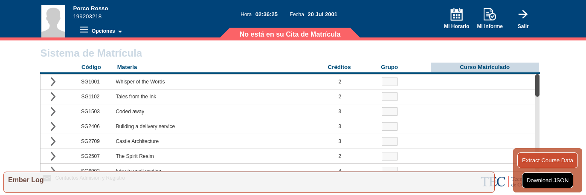
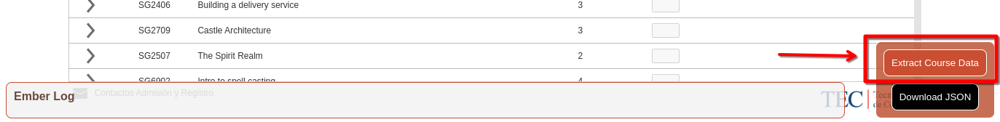
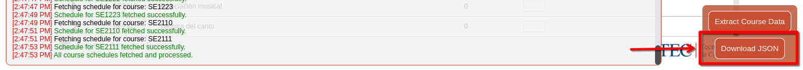

# Ember

## Description

**Ember** is a project aimed at putting your **ITCR** schedule together a bit easier.

It's comprised of **2** parts; "**Flint**" and "**Steel**".

"**Flint**" is a web script that runs within the browser extension **ViolentMonkey**, it'll gather the **schedule information** for the courses you currently have access to, and it'll export said data into a `.json` file which will be used in "**Steel**".

"**Steel**" is the schedule builder section of Ember, its a **Python** script that will used the `.json` obtained from "**Flint**" in order to build out your schedule.

---

## Usage

### Requirements

In order to utilize this project you'll need the following:

 - ViolentMonkey.
   - [ViolentMonkey for Chrome](https://chromewebstore.google.com/detail/violentmonkey/jinjaccalgkegednnccohejagnlnfdag)
   - [ViolentMonkey for Firefox](https://addons.mozilla.org/en-US/firefox/addon/violentmonkey/)
   - [ViolentMonkey for Edge](https://microsoftedge.microsoft.com/addons/detail/violentmonkey/eeagobfjdenkkddmbclomhiblgggliao)
 - [Python](https://www.python.org/downloads/).
 - Git (optional).
    - [Git for Linux](https://git-scm.com/downloads/linux)
    - [Git for Windows](https://git-scm.com/downloads/win)
    - [Git for macOS](https://git-scm.com/downloads/mac)

### Steps

#### Flint

1. Open your preferred web browser.
2. Install ViolentMonkey.
3. Install "**Flint**" as a script within ViolentMonkey ([Click Here](flint/ember-flint.user?raw=True)).
4. Go to the ITCR "**matrícula**" page, sign in, and get to the page where all the courses are listed.
 

5. Press the orange "**Extract Course Data**" button at the bottom right section of the screen.

6. Wait for all of the data to be extracted and parsed.
7. After the process has finished, you should be able to check by the **messages** in the terminal.

8. Hit the "**Download JSON Button**", save the newly generated `ember_schedule_export.json` in a place you'll have access to.

####  Steel

1. Have Python installed.
2. Download this repo by either running `git clone https://github.com/rgdan/Ember` or clicking on the green "code" button and selecting "Download ZIP" and then unzipping the file.
3. Navigate to the correct part of the repo by doing `cd Ember/steel/`.
4. Run `pip3 install -r requirements.txt` on MacOS & Linux or `pip install -r requirements.txt` on Windows to install required dependencies.
5. Run the script by doing `python steel.py` on MacOS & Linux or `python3 steel.py` on Windows.
6. Give the script the path to the `ember_schedule_export.json` file.
7. Done! Steel behaves in a terminal like fashion, if you're lost you can use the `help` command.

---

## License

This project is under the [MIT license](LICENSE.md).

---

## Special Notes

- Si **alguien administrativo** está preocupado porque la parte inicial de conseguir los horarios **cause mayor tráfico en la red**, los invito a ver el funcionamiento del **script**. Él mismo obtiene los horarios **de la misma manera que lo haría un estudiante normal**. Mi punto, siendo, **tiene la misma carga que si un estudiante abriera todos los cursos a los que tiene acceso**.

